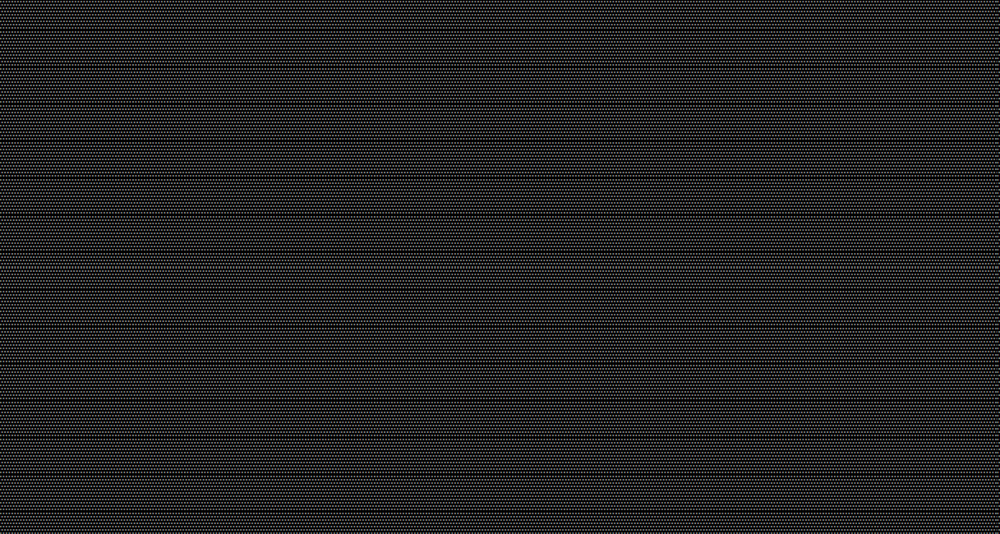

# Desktop

The desktop is the root control for all controls in an AppCUI application. There is only onde such object created and it is always created during the AppCUI framework initialization. Creating another desktop object after this point will result in a panic.

The desktop will always have the same size as the terminal. Resizing the terminal implicetelly resizes the desktop as well.

The desktop object is created by default when the AppCUI framework is initiated (via `App::new(...)` command). However, if needed a [custom desktop](custom_desktop.md) can be provided.