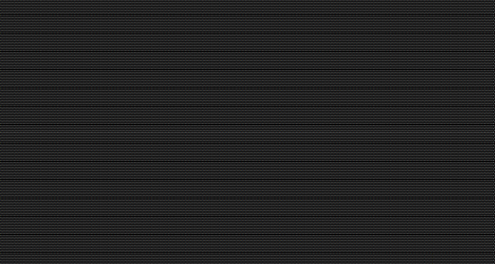

# Desktop

The desktop is the root control for all controls in an AppCUI application. There is only one such object, and it is always created during AppCUI framework initialization. Creating another desktop object after this point will result in a panic.

The desktop will always have the same size as the terminal. Resizing the terminal implicitly resizes the desktop as well.

The desktop object is created by default when the AppCUI framework is initialized (via `App::new(...)`). However, if needed, a [custom desktop](custom_desktop.md) can be provided.