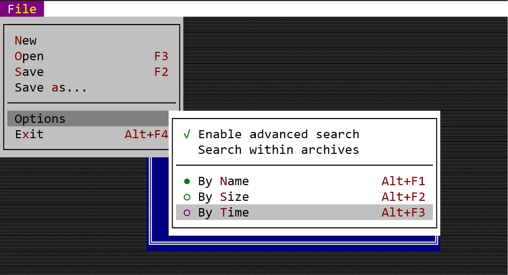

# Menu

A menu is a list of items (that represents commands, checkboxes and single choice elements) that can be display over the existing controls.



To create a menu, use `Menu::new(...)` method or the macro `menu!` (this can be used to quickly create complex static menus). 

```rs
let m = Menu::new("&File")
```

The name of the menu might include the special character `&`. This designames the next character as the hot key needed to activate the menu (in the previous example this will be `Alt+F`).

## Registration

Each menu, once create has to be registered into the **AppCui** framework (registration will provide a handle to that menu that can further be used to get access to it). To register a menu, use the `.register_menu(...)` method that is available on every control.

A common flow is to create menus when initializing a control (usually a window), just like in the following example:

```rs
#[Window(events = MenuEvents, commands=[<list of commands>)]
struct MyWin {
    menu_handle_1: Handle<Menu>,
    menu_handle_2: Handle<Menu>,
    // other haddles
}
impl MyWin {
    fn new() -> Self {
        let mut w = MyWin {
            base: window!(...),
            menu_handle_1: Handle::None,
            menu_handle_2: Handle::None,
            // other handle initialization,
        };
        // first menu
        let m1 = Menu::new(...);
        // add items to menu 'm1'
        w.menu_handle_1 = w.register_menu(m1);

        // second menu
        let m2 = Menu::new(...);
        // add items to menu 'm2'
        w.menu_handle_2 = w.register_menu(m2);

        w
    }
}
```

## Events

Using a menu implies that you will need to implement `MenuEvents` into the desktop / window or a custom control to receive the associated action from a menu. `MenuEvents` trait is described as follows:

```rs

trait MenuEvents {
    fn on_menu_open(&self, menu: &mut Menu) {
        // called whenever a menu is being opened
        // by AppCUI framework
        // This method can be use to change 
        // certain menu related aspects, such as
        // - enable/disable menu items
        // - add new items
    }

    fn on_command(&mut self, menu: Handle<Menu>, item: Handle<menu::Command>, command: mywin::Commands) {
        // this is called whenever a Command menu 
        // item is being cliecked
    }

    fn on_check(&mut self, menu: Handle<Menu>, item: Handle<menu::CheckBox>, command: mywin::Commands, checked: bool) {
        // this is called whenever a CheckBox menu 
        // item is being cliecked

    }

    fn on_select(&mut self, menu: Handle<Menu>, item: Handle<menu::SingleChoice>, command: mywin::Commands) {
        // this is called whenever a SingleChoice menu 
        // item is being cliecked

    }

    fn on_update_menubar(&self, menubar: &mut MenuBar) {
        // this is called whenever the menu bar
        // needs to be update. This is where
        // registered menus can be add to the 
        // desktop menu bar.
    }
}
```

## Methods

The following methods are available for every `Menu` object

| Method         | Purpose                                                               |
| -------------- | --------------------------------------------------------------------- |
| `add(...)`     | Adds a new menu item to the existing menu and returns a Handle for it |
| `get(...)`     | Returns an immutable reference to a menu item                         |
| `get_mut(...)` | Returns a mutable reference to a menu item                            |

Besides this the following [methods](../chapter-3/common_methods.md#menu-related-methods) are available in each control and allow menu manipulation.