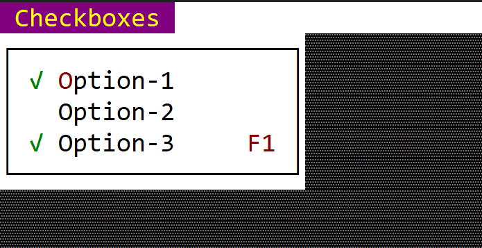

# Checkbox (menu item)

 A checkbox menu item is an equivalent of a checkbo but for menus. 
 
 
 
 You can create it using either `menu::CheckBox::new(...)` method or via the `menuitem!` macro.

 ```rs
 let cbox = menu::CheckBox::new("Option", Key::new(KeyCode::F1,KeyModifier::None), <module>::Command::Content, true);
 ```
 or
 ```rs
 let cbox = menu::CheckBox::new("Option", key!("F1"), <module>::Command::Content, false);
 ```
 or
 ```rs
 let cbox = menuitem!("Option,F1,'<module>::Command::Content',type:Checkbox");
 ```
 or
 ```rs
 let cbox = menuitem!("Option,F1,cmd:Content,class:<class-name>,checked:true");
 ```

## Macro build

The following parameters are accepted by `menuitem!` when building a checkbox menu item:

| Parameter name                                 | Type   | Positional parameter                  | Purpose                                                                                                                                                                                                                                             |
| ---------------------------------------------- | ------ | ------------------------------------- | --------------------------------------------------------------------------------------------------------------------------------------------------------------------------------------------------------------------------------------------------- |
| `text` or `caption`                            | String | **Yes** (first postional parameter)   | The caption (text) of the checkbox. If the caption contains the special character `&` the next character after that will act as a short key (meaning that pressing that character while that menu is opened is equivalent to clicking on that item) |
| `key` or `shortcut` or `shortcutket`           | String | **Yes** (second positional parameter) | The shortcut associated with the checkbox. If not specified it will be considered `Key::None`                                                                                                                                                       |
| `cmd` or `cmd-id` or `command` or `command-id` | String | **Yes** (third positional parameter)  | The associated command id for this item                                                                                                                                                                                                             |
| `check` or `checked`                           | Bool   | **No**                                | `true` if the item is checked, `false` otherwise                                                                                                                                                                                                    |
| `type`                                         | String | **No**                                | The type of the item (for a checbox item if this filed is being specified its value must be `checkbox`)                                                                                                                                             |
| `class`                                        | String | **No**                                | The name of the class where the menu is being implemented                                                                                                                                                                                           |
| `enable` or `enabled`                          | Bool   | **No**                                | Use this to disable or enable a menu item                                                                                                                                                                                                           |

## Events
To intercept events this item, the following trait and method have to be implemented to the Window that processes the event loop:
```rs
trait MenuEvents {
    fn on_check(&mut self, menu: Handle<Menu>, item: Handle<menu::CheckBox>, command: <module>::Commands, checked: bool) {
        // this is called whenever a CheckBox menu 
        // item is being cliecked

    }
}
```

## Methods

The following methods are availble for a `menu::CheckBox` object:

| Method              | Purpose                                                                                                                                                                                                                                                               |
| ------------------- | --------------------------------------------------------------------------------------------------------------------------------------------------------------------------------------------------------------------------------------------------------------------- |
| `set_caption(...)`  | Set the new caption for the item. If the string provided contains the special character `&`, this method also sets the hotkey associated with an item. If the string provided does not contain the `&` character, this method will clear the current hotkey (if any). |
| `get_caption()`     | Returns the current caption of an item                                                                                                                                                                                                                                |
| `set_checked(...)`  | Checkes or uncheckes current ite,                                                                                                                                                                                                                                     |
| `is_checked()`      | `true` if the item is checked, `false` otherwise                                                                                                                                                                                                                      |
| `set_enables(...)`  | Enables or disables current item                                                                                                                                                                                                                                      |
| `is_enabled()`      | `true` if the item is enables, `false` otherwise                                                                                                                                                                                                                      |
| `set_shortcut(...)` | Sets a new shortcut for the current item                                                                                                                                                                                                                              |
| `get_shortcu()`     | Returns the shortcut for the current item                                                                                                                                                                                                                             |

## Example

The following code creates a menu with 3 menu items (of type checkbox). Notice that we had to initialize the application with support for menus.

```rs
use appcui::prelude::*;

#[Window(events = MenuEvents, commands=Cmd1+Cmd2+Cmd3)]
struct MyWin {
    m_commands: Handle<Menu>,
}
impl MyWin {
    fn new() -> Self {
        let mut w = MyWin {
            base: window!("Test,d:c,w:40,h:8"),
            m_commands: Handle::None,
        };
        let mut m = Menu::new("Checkboxes");
        m.add(menu::CheckBox::new("&Option-1", Key::None, mywin::Commands::Cmd1,true));
        m.add(menu::CheckBox::new("Option-2", Key::None, mywin::Commands::Cmd2,false));
        m.add(menuitem!("Option-3,F1,cmd:Cmd3,class:MyWin,checked:true"));
        w.m_commands = w.register_menu(m);

        w
    }
}
impl MenuEvents for MyWin {

    fn on_check(&mut self,menu:Handle<Menu>,item:Handle<menu::CheckBox>,command:mywin::Commands,checked:bool) {
        match command {
            mywin::Commands::Cmd1 => { /* do something with option 1 */ },
            mywin::Commands::Cmd2 => { /* do something with option 2 */ },
            mywin::Commands::Cmd3 => { /* do something with option 3 */ },
        }
    }
    fn on_update_menubar(&self, menubar: &mut MenuBar) {
        menubar.add(self.m_commands);
    }
}

fn main() -> Result<(), appcui::system::Error> {
    let mut a = App::new().menu().build()?;
    a.add_window(MyWin::new());
    a.run();
    Ok(())
}
```