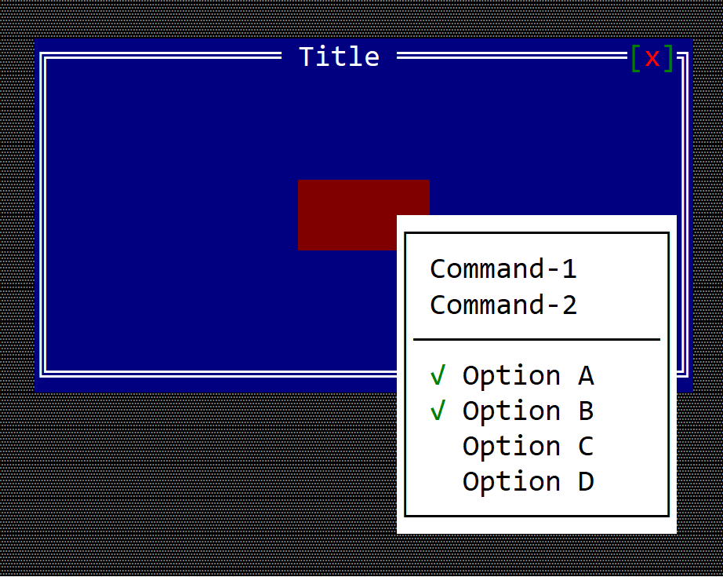

# Popup Menu

A popup menu is a meniu that is display outside of a menubar (for example a menu that appears when right click is being pressed):



**Remarks**: There is no need to enable the mouse bar when creating for a popup menu.

There is no special control for a popup menu. A popup menu is a menu that is being displayed differently. Usually a popup menu is associated with either a window, a custom control or a custom desktop and it implies using the method `show_menu` available on all controls:

```rs
fn show_menu(&self, handle: Handle<Menu>, x: i32, y: i32, max_size: Option<Size>) {
    ...
}
```
where:
* `handle` is a handle to a menu that was registered via `register_menu(...)` method
* `x` and `y` are coordonates within the current control where the menu should be displayed. Keep in mind that by default AppCUI will try to position the menu to the bottom-right side of the provided coordonates. However, if the menu does not fit in the available space, it will try to position the menu in a different way so that it is visible on the screen.
* `max_size` an **Option** that allows one to control the maximum size of a menu. By default, a menu will attemp to increase its width and height to show all items while being visible on the screen. This behavior can be overwritten by providing a maximum width and height (keep in mind that the maximum width has to be at least **5** characters - to have at least **3** items visible)

## Example

The following example creates a custom control that can display a popup menu when the use right click the mouse on it:

```rs
use appcui::prelude::*;


#[CustomControl(events    : MenuEvents, 
                overwrite : OnPaint+OnMouseEvent,
                commands  : A+B+C)]
struct MyCustomControl {
    popup_menu: Handle<Menu>,
}
impl MyCustomControl {
    fn new() -> Self {
        let mut w = MyCustomControl {
            base: ControlBase::new(Layout::new("a:c,w:8,h:2"), true),
            popup_menu: Handle::None,
        };
        // construct a popup menu
        let m = menu!("Popup,class: MyCustomControl, items=[
            {Command-1,cmd:A},
            {Command-2,cmd:B},
            {-},
            {'Option A',checked:true, cmd:C},
            {'Option B',checked:true, cmd:C},
            {'Option C',checked:false, cmd:C},
            {'Option D',checked:false, cmd:C},
        ]");
        w.popup_menu = w.register_menu(m);

        w
    }
}
impl MenuEvents for MyCustomControl {

    fn on_command(&mut self, _menu: Handle<Menu>, _item: Handle<menu::Command>, command: mycustomcontrol::Commands) {
        match command {
            mycustomcontrol::Commands::A => { /* do something */ },
            mycustomcontrol::Commands::B => { /* do something */ },
            mycustomcontrol::Commands::C => { /* do something */ },
        }
    }
}
impl OnPaint for MyCustomControl {
    fn on_paint(&self, surface: &mut Surface, _theme: &Theme) {
        surface.clear(char!("' ',White,DarkRed"));
    }
}
impl OnMouseEvent for MyCustomControl {
    fn on_mouse_event(&mut self, event: &MouseEvent) -> EventProcessStatus {
        // if the event is a mouse click
        if let MouseEvent::Pressed(ev) = event {
            // if the button is the right one
            if ev.button == MouseButton::Right {
                // show the popup menu at mouse coordinates
                self.show_menu(self.popup_menu, ev.x, ev.y, None);
            }
        }
        EventProcessStatus::Ignored
    }
}

fn main() -> Result<(), appcui::system::Error> {
    let mut a = App::new().build()?;
    let mut w = window!("Title,a:c,w:40,h:10");
    w.add(MyCustomControl::new());
    a.add_window(w);
    a.run();
    Ok(())
}
```