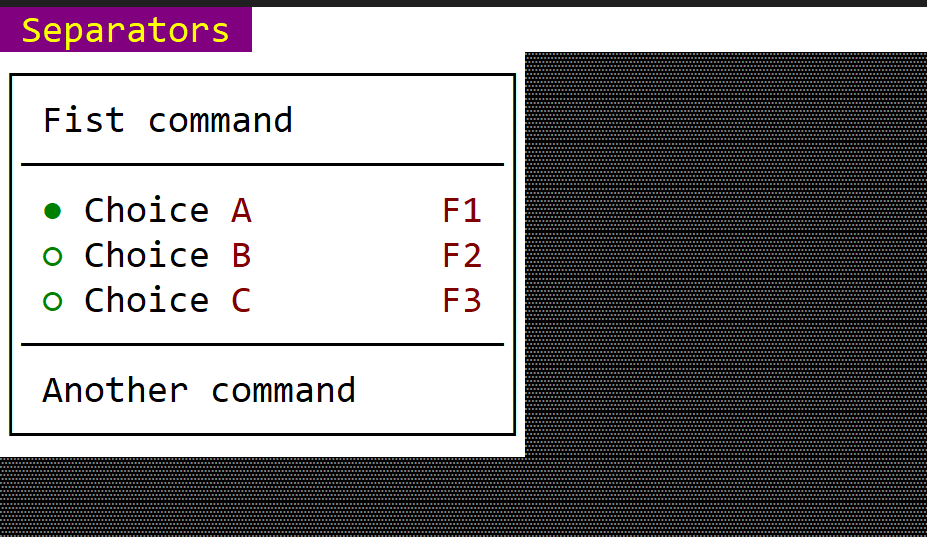

# Separator

 A separator item is designed to provide a way to separate groups of menu items. 
 
 
 
 You can create it using either `menu::Separator::new()` method or via the `menuitem!` macro.

 ```rs
 let sep = menu::Separator::new();
 ```
 or
 ```rs
 let sep = menuitem!("---");
 ```
 or
 ```rs
 let sep = menuitem!("type:separator");
 ```

## Macro build

The following parameters are accepted by `menuitem!` when building a command menu item:

| Parameter name | Type   | Positional parameter | Purpose                                                                                                  |
| -------------- | ------ | -------------------- | -------------------------------------------------------------------------------------------------------- |
| `type`         | String | **No**               | The type of the item (for a command item if this filed is being specified its value must be `separator`) |

## Events

There are no events associated with a separator.

## Methods

There are no events associated with a separator.

## Example

The following code creates a menu with multiple items separated between them.

```rs
use appcui::prelude::*;

#[Window(events = MenuEvents, commands=Cmd1+Cmd2+Cmd3)]
struct MyWin {
    m_commands: Handle<Menu>,
}
impl MyWin {
    fn new() -> Self {
        let mut w = MyWin {
            base: window!("Test,d:c,w:40,h:8"),
            m_commands: Handle::None,
        };
        let mut m = Menu::new("Separators");
        m.add(menu::Command::new("Fist command", Key::None, mywin::Commands::Cmd1));
        m.add(menu::Separator::new());
        m.add(menuitem!("'Choice &A',F1,cmd:Cmd3,class:MyWin,selected:true"));
        m.add(menuitem!("'Choice &B',F2,cmd:Cmd3,class:MyWin,selected:false"));
        m.add(menuitem!("'Choice &C',F3,cmd:Cmd3,class:MyWin,selected:false"));
        m.add(menuitem!("---"));
        m.add(menu::Command::new("Another command", Key::None, mywin::Commands::Cmd2));
        w.m_commands = w.register_menu(m);

        w
    }
}
impl MenuEvents for MyWin {
    fn on_update_menubar(&self, menubar: &mut MenuBar) {
        menubar.add(self.m_commands);
    }
}

fn main() -> Result<(), appcui::system::Error> {
    let mut a = App::new().menu_bar().build()?;
    a.add_window(MyWin::new());
    a.run();
    Ok(())
}
```