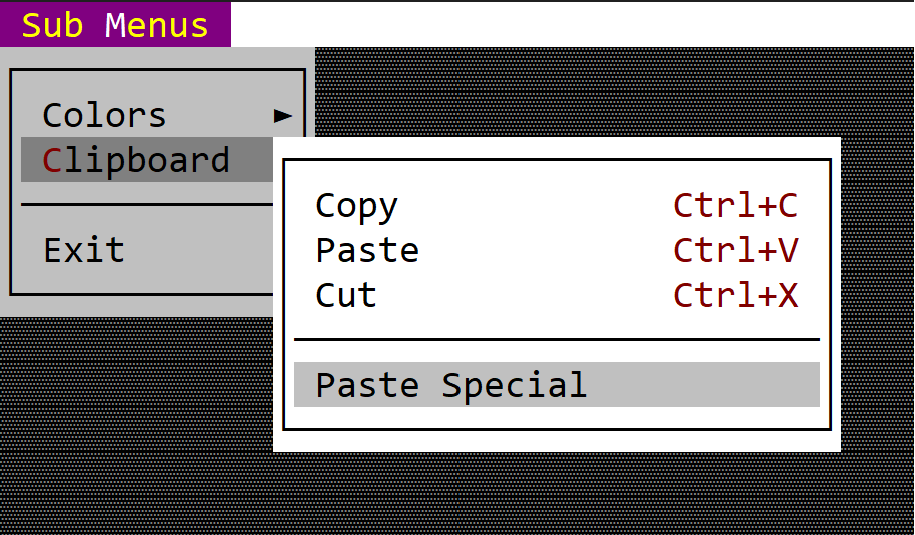

# Sub Menus 

 A sub menu item is a container for another menu. 
 
 
 
 You can create it using either `menu::SubMenu::new(...)` method or via the `menuitem!` macro.

 ```rs
 let cmd = menu::SubMenu::new(Menu::new(...));
 ```
 or
 ```rs
 let cmd = menuitem!("Content,items=[...]");
 ```
 or
 ```rs
 let cmd = menuitem!("Content,class:<class-name>,items=[...]");
 ```

## Macro build

The following parameters are accepted by `menuitem!` when building a command menu item:

| Parameter name        | Type   | Positional parameter                | Purpose                                                                                                                                                                                                                                            |
| --------------------- | ------ | ----------------------------------- | -------------------------------------------------------------------------------------------------------------------------------------------------------------------------------------------------------------------------------------------------- |
| `text` or `caption`   | String | **Yes** (first postional parameter) | The caption (text) of the submenu. If the caption contains the special character `&` the next character after that will act as a short key (meaning that pressing that character while that menu is opened is equivalent to clicking on that item) |
| `type`                | String | **No**                              | The type of the item (for a sub-menu item if this filed is being specified its value must be `submenu`)                                                                                                                                            |
| `class`               | String | **No**                              | The name of the class where the menu is being implemented                                                                                                                                                                                          |
| `enable` or `enabled` | Bool   | **No**                              | Use this to disable or enable a menu item                                                                                                                                                                                                          |

**Remarks**: Using the `class` attribute in a sub-menu will trigger an inheritence of that attribute for all sub items and sub menus. Check out [Build a menu with macros](macro_builder.md) for more details.


## Events

There are no command based events associated with a sub-menu. When clicked (or the `Enter` key is being pressed) the sub-menu will open and `on_menu_open` will be called (if needed to change the status of some of the sub-menu items):

```rs
trait MenuEvents {
    fn on_menu_open(&self, menu: &mut Menu) {
        // called whenever a menu is being opened
        // by AppCUI framework
        // This method can be use to change 
        // certain menu related aspects, such as
        // - enable/disable menu items
        // - add new items
    }
```

## Methods

The following methods are availble for a `menu::SubMenu` object:

| Method             | Purpose                                                                                                                                                                                                                                                               |
| ------------------ | --------------------------------------------------------------------------------------------------------------------------------------------------------------------------------------------------------------------------------------------------------------------- |
| `set_caption(...)` | Set the new caption for the item. If the string provided contains the special character `&`, this method also sets the hotkey associated with an item. If the string provided does not contain the `&` character, this method will clear the current hotkey (if any). |
| `caption()`        | Returns the current caption of an item                                                                                                                                                                                                                                |
| `set_enables(...)` | Enables or disables current item                                                                                                                                                                                                                                      |
| `is_enabled()`     | `true` if the item is enables, `false` otherwise                                                                                                                                                                                                                      |

## Example

The following code creates a menu with 3 menu items (of type command). Notice that we had to initialize the application with support for menus.

```rs
use appcui::prelude::*;

#[Window(events = MenuEvents, commands=Red+Green+Blue+Copy+Paste+Cut+PasteSpecial+Exit)]
struct MyWin {
    m_submenus: Handle<Menu>,
}
impl MyWin {
    fn new() -> Self {
        let mut w = MyWin {
            base: window!("Test,d:c,w:40,h:8"),
            m_submenus: Handle::None,
        };
        let mut m = Menu::new("Sub &Menus");
        let mut m_colors = Menu::new("Colors");
        m_colors.add(menuitem!("Red,selected:true,cmd:Red,class:MyWin"));
        m_colors.add(menuitem!("Green,selected:true,cmd:Green,class:MyWin"));
        m_colors.add(menuitem!("Blue,selected:true,cmd:Blue,class:MyWin"));
        m.add(menu::SubMenu::new(m_colors));

        let mut m_clipboard = Menu::new("&Clipboard");
        m_clipboard.add(menuitem!("Copy,Ctrl+C,cmd:Copy,class:MyWin"));
        m_clipboard.add(menuitem!("Paste,Ctrl+V,cmd:Paste,class:MyWin"));
        m_clipboard.add(menuitem!("Cut,Ctrl+X,cmd:Cut,class:MyWin"));
        m_clipboard.add(menuitem!("---"));
        m_clipboard.add(menuitem!("'Paste Special',None,cmd:PasteSpecial,class:MyWin"));
        m.add(menu::SubMenu::new(m_clipboard));

        m.add(menuitem!("---"));
        m.add(menu::Command::new("Exit", Key::None, mywin::Commands::Exit));
        w.m_submenus = w.register_menu(m);

        w
    }
}
impl MenuEvents for MyWin {
    fn on_update_menubar(&self, menubar: &mut MenuBar) {
        menubar.add(self.m_submenus, 0);
    }
    fn on_command(&mut self, menu: Handle<Menu>, item: Handle<menu::Command>, command: mywin::Commands) {
        match command {
            mywin::Commands::Copy => { /* Copy command was called */ }
            mywin::Commands::Paste => { /* Paster command was called */ },
            mywin::Commands::Cut => { /* Cut command was called */ },
            mywin::Commands::PasteSpecial => { /* PasteSpecial command was called */ },
            mywin::Commands::Exit => { /* Exit command was called */ },
            _ => {}
        }
    }

    fn on_select(&mut self, menu: Handle<Menu>, item: Handle<menu::SingleChoice>, command: mywin::Commands) {
        match command {
            mywin::Commands::Red => { /* Red color was selected */ }
            mywin::Commands::Green => { /* Green color was selected */ }
            mywin::Commands::Blue => { /* Blue color was selected */ }
            _ => {}
        }
    }
}

fn main() -> Result<(), appcui::system::Error> {
    let mut a = App::new().menu_bar().build()?;
    a.add_window(MyWin::new());
    a.run();
    Ok(())
}
```