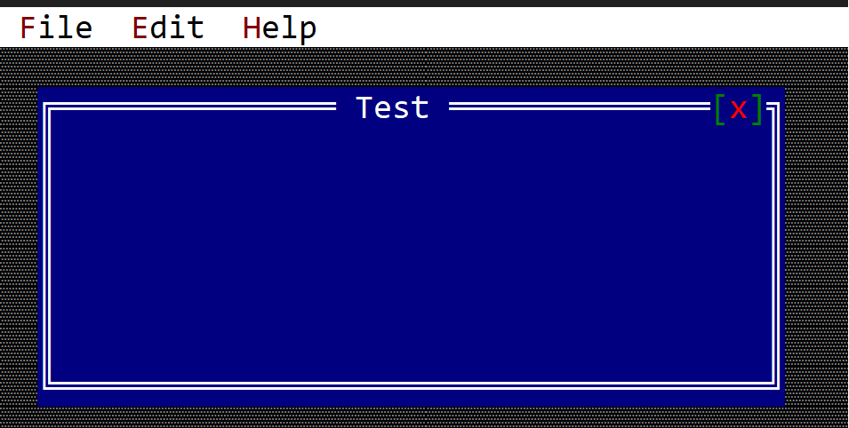

# Menu Bar

A menu bar is a bar (on the top part of a desktop and on top of every window) that contains all menus associated with an application.



The menu bar is unique per application. This means, that you need to enable it when a new application is created. A tipical way to do this is by using `.menu_bar()` method when building an application, like in the following snippet:

```rust
let mut app = App.App::new().menu_bar().build()?;
```

Once you enabled the menu bar, you will need to implement `MenuEvents` on your window or custom control, and you will also need to add a list of commands when you create your window and/or custom control. A typical template of these flows look like this:

```rust
#[Window(events = MenuEvents, commands=[Command_1, Command_2 ... Command_n])]
struct MyWin { /* data member */ }
impl MyWin { /* internal methods */ }
impl MenuEvents for MyWin {
    // other event related methods

    fn on_update_menubar(&self, menubar: &mut MenuBar) {
        // this is called whenever the menu bar
        // needs to be update. This is where
        // registered menus can be add to the 
        // desktop menu bar.
    }
}
```

More details on the `MenuEvents` trait can be found on [Menu](menu.md) chapter.

Its also important to note that `on_update_menubar` is being called only if the current focus (or one of its children) has focus. This implies that except for the case where a modal window is opened, this method will always be called for the desktop object. 

Whenever the focus changes, the menu bar is cleared and the method `on_update_menubar` is being recall for each control from the focused one to its oldest ancestor (in most cases, the desktop).

You can always request an update to the command bar if by calling the method `.request_update()` that every control should have. This method will force AppCUI to recall `on_update_menubar` from the focused control to its oldest ancestor. Keep in mind that this command will not neccesarely call the `on_update_menubar` for the control that calls `request_update` , unless that control has the focus.

## Usage

A menu bar has only one method:
```rs
pub fn add(&mut self, handle: Handle<Menu>) { ... }
```

This method is typically used to link a menu handle to a menu bar. This also implies that you have to register a menu first, save its handle and only then add it to the menu bar. A typical template of these flows look like this:

```rust
#[Window(events = MenuEvents, ...)]
struct MyWin { 
    menu_handle_1: Handle<Menu>,
    menu_handle_2: Handle<Menu>,
    // other menu handles or data members
 }
impl MyWin { 
    fn new()->Self {
        let mut w = MyWin { /* code to instantiate the structure */ };
        w.menu_handle_1 = w.register_menu(Menu::new(...)); 
        w.menu_handle_2 = w.register_menu(Menu::new(...)); 
        // other initialization methods
        w
    }

 }
impl MenuEvents for MyWin {
    fn on_update_menubar(&self, menubar: &mut MenuBar) {
        menubar.add(self.menu_1, 0); // add first menu to the menu bar
        menubar.add(self.menu_2, 0); // add the second menu to the menu bar
    }
}
```
All menus from the menu bar will be displayed in the order they were added. 


## Example

The following example shows a window that creates 3 menus: `File`, `Edit` and `Help` and adds them in this order to the menu bar.

```rust
use appcui::prelude::*;

#[Window(events   = MenuEvents, 
         commands = New+Save+Open+Exit+Copy+Paste+Delete+Cut+CheckUpdate+Help+About)]
struct MyWin {
    m_file: Handle<Menu>,
    m_edit: Handle<Menu>,
    m_help: Handle<Menu>,
}
impl MyWin {
    fn new() -> Self {
        let mut w = MyWin {
            base: window!("Test,d:c,w:40,h:8"),
            m_file: Handle::None,
            m_edit: Handle::None,
            m_help: Handle::None,
        };
        w.m_file = w.register_menu(menu!("&File,class:MyWin,items=[
            { &New,cmd:New },
            { &Save,F2,cmd:Save },
            { &Open,F3,cmd:Open },
            { --- },
            { Exit,cmd:Exit }
        ]"));
        w.m_edit = w.register_menu(menu!("&Edit,class:MyWin,items=[
            { &Copy,Ctrl+Ins,cmd:Copy },
            { &Paste,Shift+Ins,cmd:Paste },
            { &Delete,cmd:Delete },
            { C&ut,Ctrl+X,cmd: Cut}
        ]"));
        w.m_help = w.register_menu(menu!("&Help,class:MyWin,items=[
            { 'Check for updates ...', cmd: CheckUpdate },
            { 'Show online help', cmd: Help },
            { --- },
            { &About,cmd:About }
        ]"));

        w
    }
}
impl MenuEvents for MyWin {
    fn on_update_menubar(&self, menubar: &mut MenuBar) {
        menubar.add(self.m_file, 0);
        menubar.add(self.m_edit, 0);
        menubar.add(self.m_help, 0);
    }
    fn on_command(&mut self, menu: Handle<Menu>, item: Handle<menu::Command>, command: mywin::Commands) {
        match command {
            mywin::Commands::New => todo!(),
            mywin::Commands::Save => todo!(),
            mywin::Commands::Open => todo!(),
            mywin::Commands::Exit => todo!(),
            mywin::Commands::Copy => todo!(),
            mywin::Commands::Paste => todo!(),
            mywin::Commands::Delete => todo!(),
            mywin::Commands::Cut => todo!(),
            mywin::Commands::CheckUpdate => todo!(),
            mywin::Commands::Help => todo!(),
            mywin::Commands::About => todo!(),
        }
    }
}
fn main() -> Result<(), appcui::system::Error> {
    let mut a = App::new().command_bar().build()?;
    a.add_window(MyWin::new());
    a.run();
    Ok(())
}
```