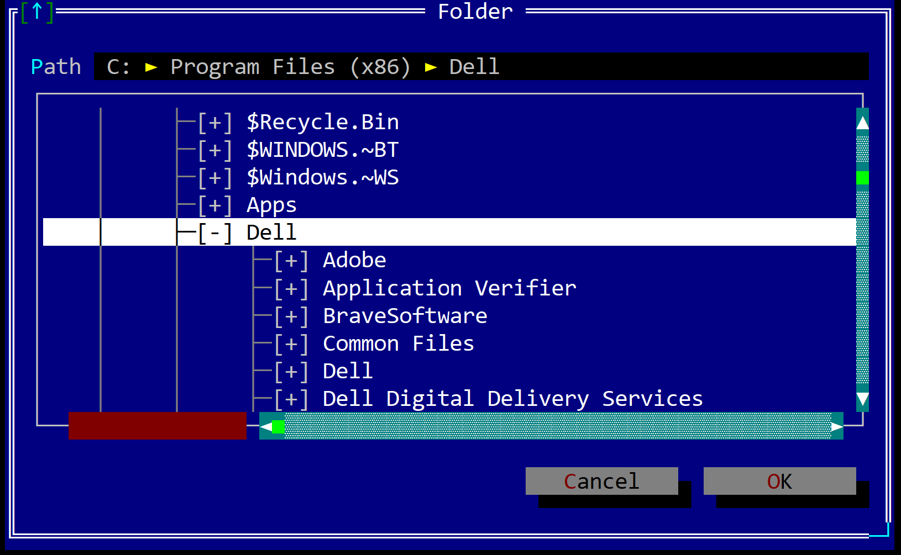

# Folder Selection Dialog

A folder selection dialog is usually used whenever your application needs to select a folder where some data will be saved or loaded from.



To open a folder selection dialog, use the following method:
```rs
fn dialogs::select_folder(title: &str, 
                          location: Location,
                          flags: SelectFolderDialogFlags) -> Option<PathBuf> 
{
    ...
}
```

where:
* `title` - the title of the dialog (usually "Save" or "Save as")
* `location` - the location / path where the dialog will be opened (see [Location](#location) for more details)
* `flags` - additional flags that can be used to customize the dialog 

The `SelectFolderDialogFlags` is defined as follows:
```rs
#[EnumBitFlags(bits = 8)]
pub enum SaveFileDialogFlags {
    Icons = 1,
}
```

where:
* `Icons` - show icons for folders and root drives

## Location

Whenever a save or open dialog is opened, you can specify the location where the dialog will be opened. The following locations are available:
* `Location::Current` - the dialog will be opened in the current directory
* `Location::Last` - the dialog will be opened on the last location where a file was saved or opened. If no file was saved or opened, the dialog will be opened in the current directory
* `Location::Path(...)` - the dialog will be opened in the specified path

## Example

The following example shows how to open a folder selection dialog:

```rs
if let Some(folder_path) = dialogs::select_folder(
            "Select Folder",
            dialogs::Location::Current,
            dialogs::SaveFileDialogFlags::None 
        ) 
{
    // do something with the folder_path    
}