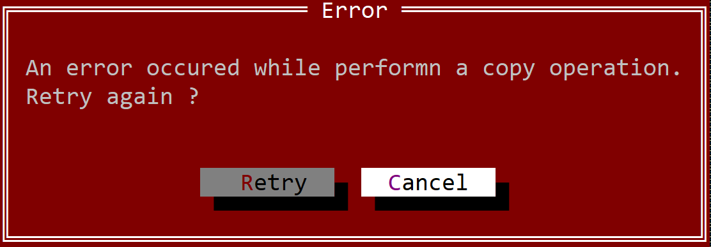

# Notification Dialogs

Notification dialogs are predefined modal window that can be used for various purposes such as:
* show an error or a warning
* provide a validation (where you need to acknoledge a certain action)
* show a message
* etc

## Errors

You can show an error by using the following method:
```rs
fn dialogs::error(title: &str, caption: &str) {...}
```
This will create a modal window with the message provided to this method and one button (that contains the caption `Ok`). The following code:

```rs
dialogs::error("Error","An error has occured during the last operation");
```

will produce the following error modal window:


Error dialogs are often use in scenarios where an error has occured and a specific action need to pe stop because of it. There are however cases where you will also want a retry option (if an error occurs, retry the same operation in the hope of another result). If this is the case, the following method can be used:
```rs
fn dialogs::retry(title: &str, caption: &str) -> bool {...}
```

This method will create an error dialog but with two buttons (`Retry` and `Cancel`). If you click on `Retry` button the method will return **true** otherwise it will return **false**. For example, the following code:
```rs
if dialogs::retry("Error","An error occured while performn a copy operation.\nRetry again ?") {
    // retry the operation
}
```
that looks like the following picture:

