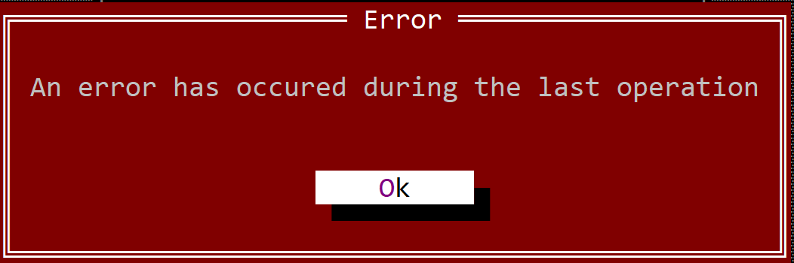
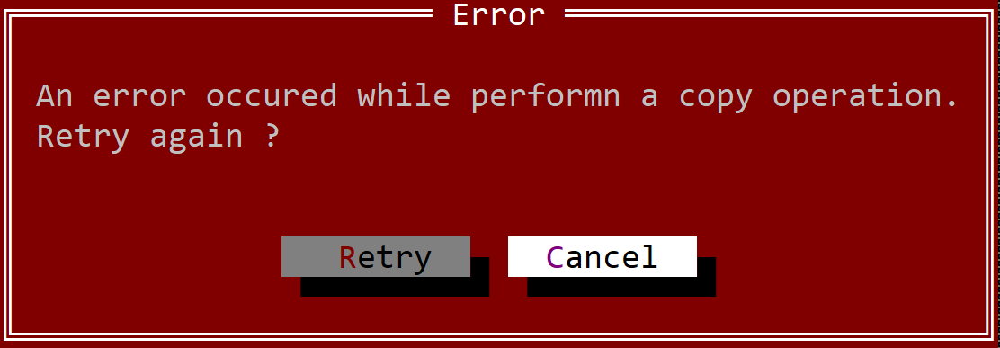
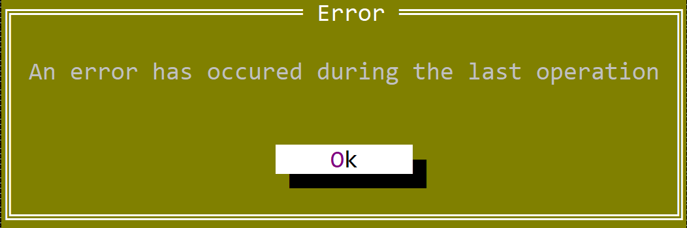
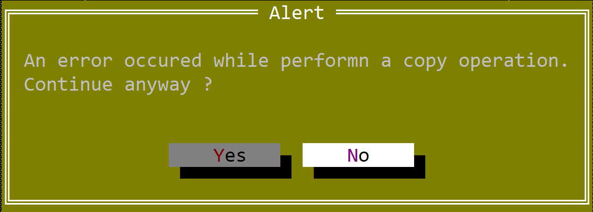
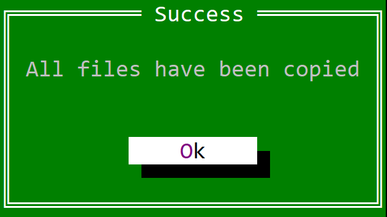
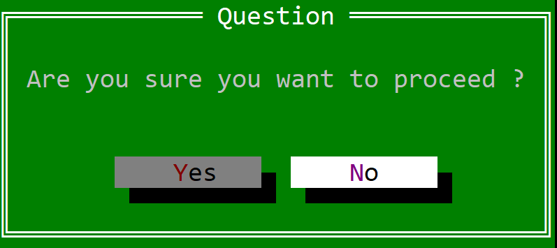
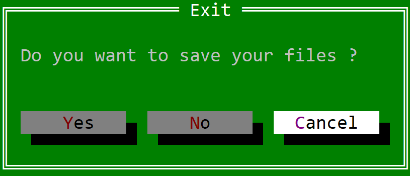

# Notification Dialogs

Notification dialogs are predefined modal windows that can be used for various purposes, such as:
* showing an error or a warning
* providing a validation (where you need to acknowledge a certain action)
* showing a message
* etc.

## Errors

You can show an error using the following method:
```rs
fn dialogs::error(title: &str, caption: &str) {...}
```
This will create a modal window with the message provided to this method and one button (that contains the caption `Ok`). The following code:

```rs
dialogs::error("Error","An error has occurred during the last operation");
```

will produce the following error modal window:



Error dialogs are often used in scenarios where an error has occurred and a specific action needs to be stopped because of it. There are, however, cases where you will also want a retry option (if an error occurs, retry the same operation in the hope of another result). If that is the case, the following method can be used:
```rs
fn dialogs::retry(title: &str, caption: &str) -> bool {...}
```

This method will create an error dialog with two buttons (`Retry` and `Cancel`). If you click the `Retry` button, the method returns **true**; otherwise it returns **false**. For example, the following code:
```rs
if dialogs::retry("Error","An error occurred while performing a copy operation.\nRetry again?") {
    // retry the operation
}
```
will create a dialog that looks like the following picture:



## Alerts

Alerts are dialogs where an error has occurred, but it is not critical for the program execution flow (it is an error from which we can recover). You can show an alert using the following method:
```rs
fn dialogs::alert(title: &str, caption: &str) {...}
```
This will create a modal window with the message (the content of variable `caption`) provided to this method and one button (that contains the caption `Ok`). The following code:

```rs
dialogs::alert("Error","An error has occurred during the last operation");
```

will produce the following error modal window:



Just like in the case of errors, if the alert is something we can ignore and continue with the execution, the following method can be used:
```rs
fn dialogs::proceed(title: &str, caption: &str) -> bool {...}
```

This method will create an alert dialog with two buttons (`Yes` and `No`). If you click the `Yes` button, the method returns **true**; otherwise it returns **false**. For example, the following code:
```rs
if dialogs::proceed("Alert","An error occurred while performing a copy operation.\nContinue anyway?") {
    // continue despite the error
}
```
will create a dialog that looks like the following picture:




## Popup messages

Popup messages are notifications of success or generic information. To show a simple message, use the following method:
```rs
fn dialogs::message(title: &str, caption: &str) {...}
```
This will create a modal window with the message (the content of variable `caption`) provided to this method and one button (that contains the caption `Ok`). The following code:

```rs
dialogs::message("Success","All files have been copied");
```

will produce the following modal window:



## Validation messages

Validation messages are simple questions that determine how execution should continue from that point. To show a validation message, use the following method:
```rs
fn dialogs::validate(title: &str, caption: &str) -> bool {...}
```
This method will create a dialog with two buttons (`Yes` and `No`). If you click the `Yes` button, the method returns **true**; otherwise it returns **false**. This is used for simple validation prompts such as `Are you sure you want to proceed?`.

For example, the following code:
```rs
if dialogs::validate("Question","Are you sure you want to proceed?") {
    // start the action
}
```
will create a dialog that looks like the following picture:



Additionally, a `validate_or_cancel` method is available with the following definition:
```rs
fn dialogs::validate_or_cancel(title: &str, caption: &str) -> ValidateOrCancelResult {...}
```
This method displays three buttons (`Yes`, `No`, and `Cancel`). The result of this dialog is described by the following enum:
```rs
#[derive(Copy,Clone,PartialEq,Eq)]
pub enum ValidateOrCancelResult {
    Yes,
    No,
    Cancel
}
```
This type of dialog should be used for scenarios where you can complete an action in two different ways, or cancel it. For example, when an application exits and you need to save data, you can choose between:
* saving the data (and closing the application)
* not saving the data (and still closing the application)
  
or
* cancel (meaning that you will not close the application)

The following code describes a similar scenario:
```rs
let result = dialogs::validate_or_cancel("Exit","Do you want to save your files?"); 
match result {
    ValidateOrCancelResult::Yes => { /* save files and then exit the application */ },
    ValidateOrCancelResult::No => { /* exit the application directly */ },
    ValidateOrCancelResult::Cancel => { /* don't exit the application */ }
}
```
and should create a dialog that looks like the following picture:

