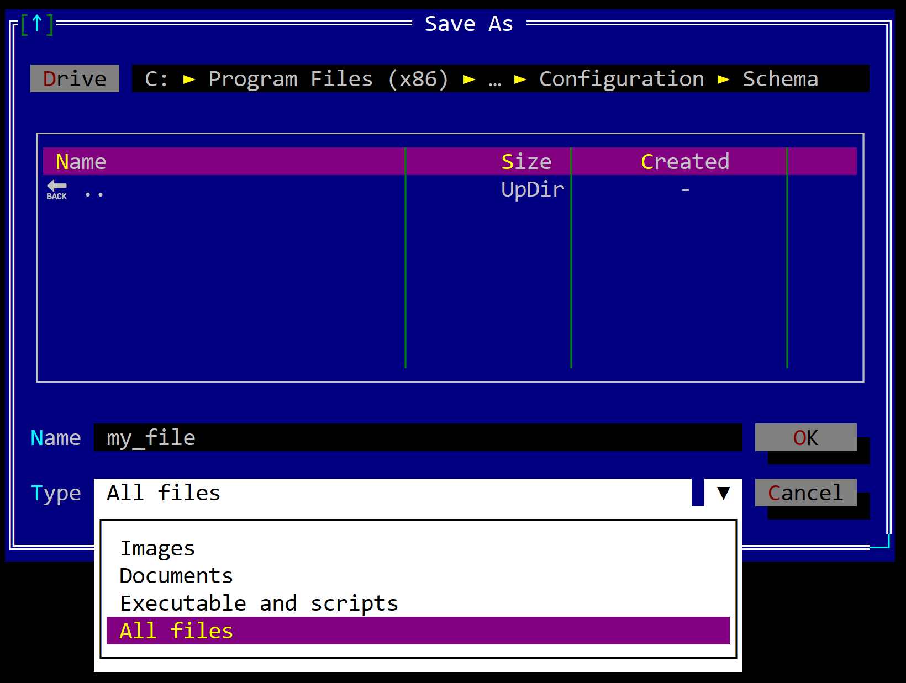
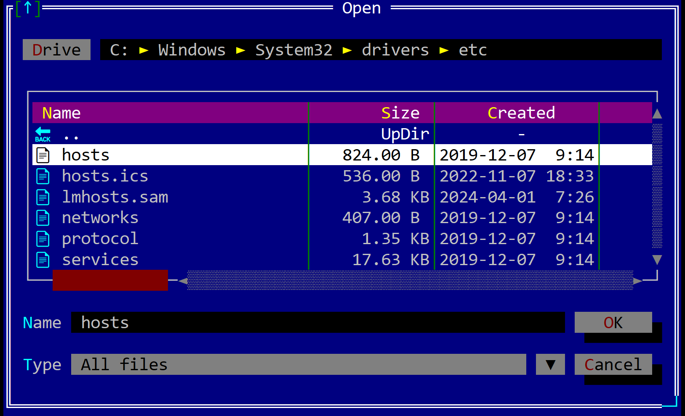

# Open/Save dialogs

Open/Save dialogs are predefined dialogs that allows you to select a file path that will further be used to save or load content from/into. The following methods are available:
* `dialogs::save`
* `dialogs::open`

## Save dialog

A save dialog is usually used whenever your application needs to save some data into a file and you need to select the location where the file will be saved.



A save dialog can be open using the following method:
```rs
fn dialogs::save(title: &str, 
                 file_name: &str, 
                 location: Location,
                 extension_mask: Option<&str>,
                 flags: SaveFileDialogFlags) -> Option<PathBuf> 
{
    ...
}
```

where:
* `title` - the title of the dialog (usually "Save" or "Save as")
* `file_name` - the default file name that will be displayed in the dialog
* `location` - the location / path where the dialog will be opened (see [Location](#location) for more details)
* `extension_mask` - a mask that will be used to filter the files that can be selected (see [Extension mask](#extension-mask) for more details). If `None` all files will be shown.
* `flags` - additional flags that can be used to customize the dialog 

The `SaveFileDialogsFlags` is defined as follows:
```rs
#[EnumBitFlags(bits = 8)]
pub enum SaveFileDialogFlags {
    Icons = 1,
    ValidateOverwrite = 2,
}
```

where:
* `Icons` - show icons for files and folders
* `ValidateOverwrite` - if the file already exists, a validation message will be shown to confirm the overwrite
  
## Open Dialog

An open dialog is usually used whenever your application needs to load some data from a file and you need to select the location of the file.



An open dialog can be open using the following method:
```rs
fn dialogs::open(title: &str, 
                 file_name: &str, 
                 location: Location,
                 extension_mask: Option<&str>,
                 flags: OpenFileDialogFlags) -> Option<PathBuf> 
{
    ...
}
```

where:
* `title` - the title of the dialog (usually "Open" or "Load")
* `file_name` - the default file name that will be displayed in the dialog
* `location` - the location / path where the dialog will be opened (see [Location](#location) for more details)
* `extension_mask` - a mask that will be used to filter the files that can be selected (see [Extension mask](#extension-mask) for more details). If `None` all files will be shown.
* `flags` - additional flags that can be used to customize the dialog 

The `OpenFileDialogsFlags` is defined as follows:
```rs
#[EnumBitFlags(bits = 8)]
pub enum OpenFileDialogFlags {
    Icons = 1,
    CheckIfFileExists = 2,
}
```

where:
* `Icons` - show icons for files and folders
* `CheckIfFileExists` - if the file does not exist, a error message will be shown abd the dialog will remain open

## Location

Whenever a save or open dialog is opened, you can specify the location where the dialog will be opened. The following locations are available:
* `Location::Current` - the dialog will be opened in the current directory
* `Location::Last` - the dialog will be opened on the last location where a file was saved or opened. If no file was saved or opened, the dialog will be opened in the current directory
* `Location::Path(...)` - the dialog will be opened in the specified path

## Extension mask

The extension mask is a string that contains multiple items in the format `display-name = [extensions lists]` separated by commas that will serve as a filter for the files that can be selected. 

For example, if we want to filter only the images, we will create a string that looks like the following:
```rs
"Images = [jpg, jpeg, png, bmp, gif]"
```

If we want to have multiple options for filtering, we can create multiple strings like the previous one and separte them by commas. For example, we we want to have three options for filtering: images, documents and executables, we will create a string like the following:
```rs
"Images = [jpg, jpeg, png, bmp, gif],
 Documents = [doc, pdf, docx, txt],
 Executables = [exe, bat, sh]
"
```

**Remarks**:
1. AppCUI will **ALWAYS** add an `All Files` options at the end of your options list.
2. The **first** item from the provided list will be the default mask when opening the dialog.

## Example

The following example shows how to use the save dialog:

```rs
if let Some(file_path) = dialogs::save(
            "Save As",
            "abc.exe",
            dialogs::Location::Current,
            Some("Images = [jpg,png,bmp], 
                  Documents = [txt,docx], 
                  Executable and scripts = [exe,dll,js,py]"),
            dialogs::SaveFileDialogFlags::Icons |
            dialogs::SaveFileDialogFlags::ValidateOverwrite 
        ) 
{
    // do something with the file_path
}
```