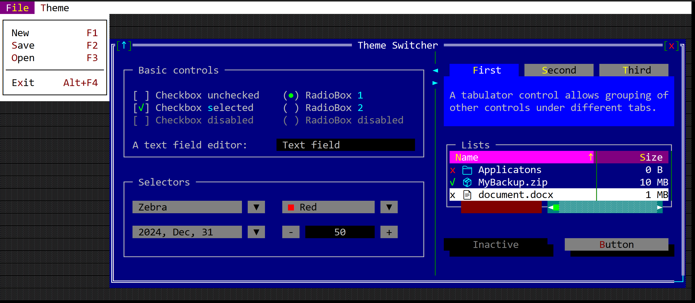
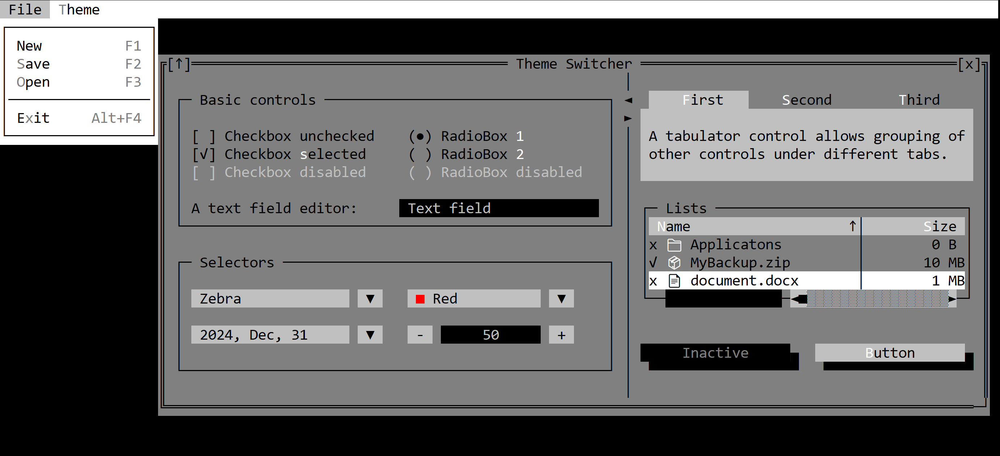
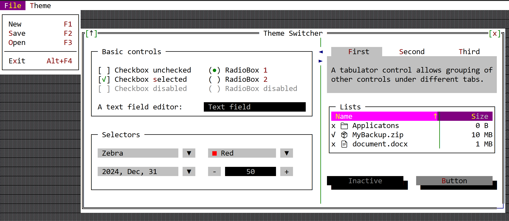

# Predefined Themes

AppCUI comes with a set of predefined themes that can be used out of the box via the `Themes` enum. The following themes are available:

1. **Default** - the default theme used by the library.
   
   

2. **DarkGray** - a dark gray theme.

    

3. **Light** - a light theme.
   
    
