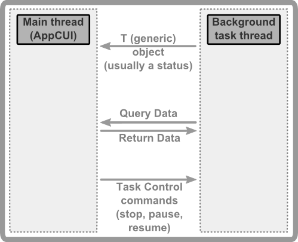

# Background Tasks

A background task is a thread that can comunicate with the main AppCUI threat and send/receive information from it, just like in the following diagram:



To start a background task, use the following command:

```rs
pub struct BackgroundTask<T,T>
where: 
    T: Send + 'static, 
    R: Send + 'static 
{ ... }

impl<T: Send, R: Send> BackgroundTask<T, R> {
    pub fn run(task: fn(conector: &BackgroundTaskConector<T, R>), 
               receiver: Handle<Window>) -> Handle<BackgroundTask<T, R>> 
    {...}
}
```

where:
* `T` represents the type that will be send from the background thread to the main thread (the thread where AppCUI runs). It is usually an enum that reflects a status (e.g. precentage of the task) or a query (information needed by the background thread)
* `R` represent the response for a query (meaning that if the background thread ask the main thread using type **T**, the reply will be of type **R**)

A `BackgroundTask` object has the following methods:

| Method                       | Description                                                                                                                                                                     |
| ---------------------------- | ------------------------------------------------------------------------------------------------------------------------------------------------------------------------------- |
| `read(...)`                  | Reads the last object of type **T** sent by the background thread to the main thread                                                                                            |
| `send(...)`                  | Sends an object of type **R** from the main thread to the background thread                                                                                                     |
| `stop()`                     | Requests the background thread to stop                                                                                                                                          |
| `pause()`                    | Requests the background thread to pause                                                                                                                                         |
| `resume()`                   | Requests the background thread to resume                                                                                                                                        |
| `update_control_handle(...)` | Updates the handle of the control that will receive events from the background thread. This is usually required if we want to close the window that shows the background thread |


A `BackgroundTaskConector<T, R>` is an object that can be used to send/receive information between the background thread and the main thread. It has the following methods:

| Method          | Description                                                                                                                                                                                                                                                                                                                                                                                  |
| --------------- | -------------------------------------------------------------------------------------------------------------------------------------------------------------------------------------------------------------------------------------------------------------------------------------------------------------------------------------------------------------------------------------------- |
| `notify(...)`   | Sends an object of type **T** from the background thread to the main thread                                                                                                                                                                                                                                                                                                                  |
| `query(...)`    | Sends an object of type **T** from the main thread to the background thread and waits until the main thread responds with an object of type **R**                                                                                                                                                                                                                                            |
| `should_stop()` | Returns `true` if the background thread should stop (meaning that the main thread requested the background thread to stop) or `false` otherwise. This method also handle **Pause** and **Resume** requests (meaning that if the main thread has requested a **pause** this method will wait until the main thread will request a **resume** or will request a stop of the background thread) |

## Events

The `BackgroundTaskEvents` event handler must be implementd on a window to receive events from a background task. It has the following methods:

```rs
trait BackgroundTaskEvents<T: Send+'static, R: Send+'static> {
    fn on_start(&mut self, task: &BackgroundTask<T,R>) -> EventProcessStatus {
        // Called when the background task is started
        EventProcessStatus::Ignored
    }
    fn on_update(&mut self, value: T, task: &BackgroundTask<T,R>) -> EventProcessStatus {
        // Called when the background task sends information to the main thread
        // via the BackgroundTaskConector::notify(...) method
        // if the return value is EventProcessStatus::Processed, the main thread will
        // repaint the window
        EventProcessStatus::Ignored
    }
    fn on_finish(&mut self, task: &BackgroundTask<T,R>) -> EventProcessStatus {
        // Called when the background task is finished
        EventProcessStatus::Ignored
    }
    fn on_query(&mut self, value: T, task: &BackgroundTask<T,R>) -> R;
    // Called when the background task sends a query to the main thread
    // via the BackgroundTaskConector::query(...) method
    // The main thread must return a value of type R
}
```

## Flow

An usual flow for a background task is the following:
1. The main thread starts a background task using the `BackgroundTask::run(...)` method
2. The window that receives this background task events should overwrite the `BackgroundTaskEvents<T,R>` event handler
3. The background thread will start and will send information to the main thread using the `BackgroundTaskConector::notify(...)` method
4. The background thread should check from time to time if the main thread requested a stop or a pause (via the `BackgroundTaskConector::should_stop()` method)
5. The main thread will be called via `BackgroundTaskEvents` event handler with the information sent by the background thread

**Example**

1. Create the coresponding type **T** and **R** that will be send between the main thread and the background thread:
    ```rs
    enum TaskStatus {
        StartWithTotaltems(u64),
        Progress(u64),
        AskToContinue,
    }
    enum Response {
        Continue,
        Stop,
    }
    ```

2. Create a window that will receive events from a background task:
    ```rs
    #[Window(events = BackgroundTaskEvents<TaskStatus,Response>)]
    struct MyWindow { ... }
    ```

3. Create a function / lambda that will execute the background task:
    ```rs
    fn background_task(conector: &BackgroundTaskConector<TaskStatus,Response>) {
        // send a start message and notify about the total items
        // that need to be processed by the background thread
        let total_items = 100;
        conector.notify(TaskStatus::StartWithTotaltems(total_items));

        // start processing items
        for crt in 0..total_items {
            // update the progress status to the main thread
            conector.notify(TaskStatus::Progress(crt));
            // check to see if the main thread has requested a stop
            if conector.should_stop() {
                break;
            }
            // if needed ask the main thread if it should continue
            // this part is optional
            if crt % 10 == 0 {
                if conector.query(TaskStatus::AskToContinue) == Response::Stop {
                    break;
                }
            }
            // do the actual work
        }
    }
    ```

4. Start the background task:
    ```rs
    let task = BackgroundTask::<TaskStatus,Response>::run(background_task, window.handle());
    ```

5. Implement the `BackgroundTaskEvents` event handler for the window:
    ```rs
    impl BackgroundTaskEvents<TaskStatus, Response> for MyWindow {
        fn on_start(&mut self, task: &BackgroundTask<TaskStatus, Response>) -> EventProcessStatus {
            // called when the background task is started
            EventProcessStatus::Processed
        }
        fn on_update(&mut self, value: TaskStatus, task: &BackgroundTask<TaskStatus, Response>) -> EventProcessStatus {
            match value {
                // process the task status value
            }
            EventProcessStatus::Processed
        }
        fn on_finish(&mut self, task: &BackgroundTask<TaskStatus, Response>) -> EventProcessStatus {
            // called when the background task is finished
            EventProcessStatus::Processed
        }
        fn on_query(&mut self, value: TaskStatus, task: &BackgroundTask<Status, Response>) -> Response {
            // return a response to the query
            Response::Continue
        }
    }
    ```

## Example

The following example shows how to create a window that will receive events from a background task and update a progress bar:

```rs
use appcui::prelude::*;

enum Status {
    Start(u32),
    Progress(u32),
}

#[Window(events = ButtonEvents+BackgroundTaskEvents<Status,bool>)]
struct MyWin {
    p: Handle<ProgressBar>,
}

impl MyWin {
    fn new() -> Self {
        let mut w = Self {
            base: window!("'Background Task',a:c,w:50,h:8,flags:sizeable"),
            p: Handle::None,
        };
        w.p = w.add(progressbar!("l:1,t:1,r:1,h:2"));
        w.add(button!("&Start,l:1,b:0,w:10"));
        w
    }
}
impl ButtonEvents for MyWin {
    fn on_pressed(&mut self, handle: Handle<Button>) -> EventProcessStatus {
        BackgroundTask::<Status, bool>::run(my_task, self.handle());
        EventProcessStatus::Processed
    }
}
impl BackgroundTaskEvents<Status, bool> for MyWin {
    fn on_update(&mut self, value: Status, _: &BackgroundTask<Status, bool>) -> EventProcessStatus {
        let h = self.p;
        if let Some(p) = self.control_mut(h) {
            match value {
                Status::Start(value) => p.reset(value as u64),
                Status::Progress(value) => p.update_progress(value as u64),
            }
            EventProcessStatus::Processed
        } else {
            EventProcessStatus::Ignored
        }
    }
    fn on_query(&mut self, _: Status, _: &BackgroundTask<Status, bool>) -> bool {
        true
    }
}

fn my_task(conector: &BackgroundTaskConector<Status, bool>) {
    conector.notify(Status::Start(100));
    for i in 0..100 {
        if conector.should_stop() {
            return;
        }
        std::thread::sleep(std::time::Duration::from_millis(100));
        conector.notify(Status::Progress(i));
    }
    conector.notify(Status::Progress(100));
}

fn main() -> Result<(), appcui::system::Error> {
    let mut a = App::new().build()?;
    a.add_window(MyWin::new());
    a.run();
    Ok(())
}
```