# AppCUI-rs Gallery

A visual tour of AppCUI-rs. Each category shows one quick preview; expand for more.

- [AppCUI-rs Gallery](#appcui-rs-gallery)
  - [Animations](#animations)
  - [Basic Controls](#basic-controls)
  - [Lists, Trees and Graphs](#lists-trees-and-graphs)
  - [Games](#games)
  - [Application Bar, Command Bar and Menus](#application-bar-command-bar-and-menus)
  - [Background Tasks and Timers](#background-tasks-and-timers)

---

## Animations

* **Code:** [examples/matrix](https://github.com/gdt050579/AppCUI-rs/tree/main/examples/matrix)
* **Elements:** [Custom Desktop](https://gdt050579.github.io/AppCUI-rs/chapter-4/custom_desktop.html), [Menus](https://gdt050579.github.io/AppCUI-rs/chapter-4/menu.html), [Timers](https://gdt050579.github.io/AppCUI-rs/chapter-7/timers.html)

  
More Examples

| Image                                   | Description                                                                                                                                                                                                                                                                                                                                                                                                                                                                                                         |
| --------------------------------------- | ------------------------------------------------------------------------------------------------------------------------------------------------------------------------------------------------------------------------------------------------------------------------------------------------------------------------------------------------------------------------------------------------------------------------------------------------------------------------------------------------------------------ |
| 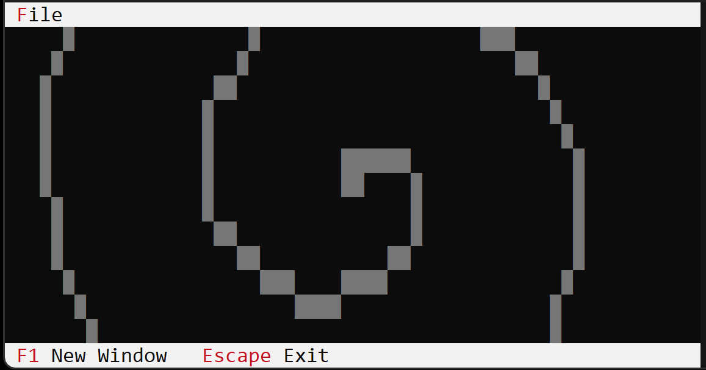  | **Spiral Animation**   * **Code:** [examples/spiral](https://github.com/gdt050579/AppCUI-rs/tree/main/examples/spiral)   * **Description:** The Spiral example defines a struct that incrementally computes spiral coordinates in polar form, applies aspect-ratio correction, and updates them each frame to illustrate animated geometry generation.                                                                                                                                                       |
| 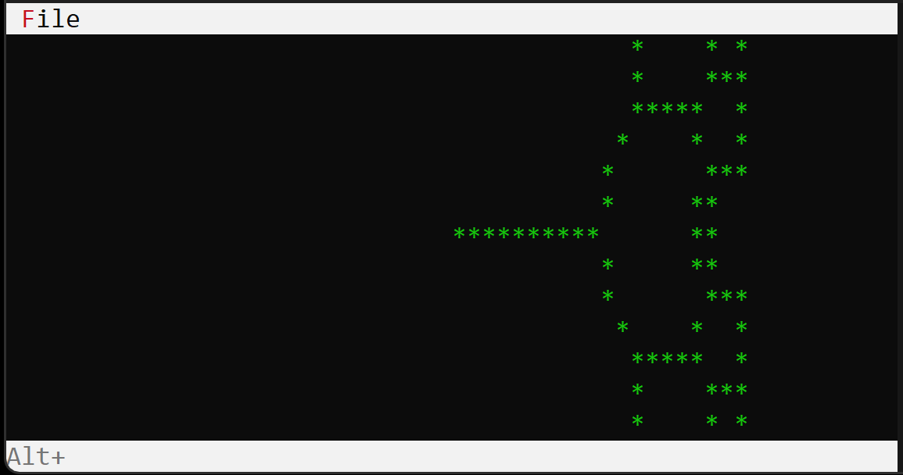 | **Fractal Animation**   * **Code:** [examples/fractal](https://github.com/gdt050579/AppCUI-rs/tree/main/examples/fractal)   * **Description:** The Fractal example constructs a recursive tree-like structure by generating line segments from a start point, computing endpoints using trigonometric functions, and branching at ±45° angles. Each update advances rotation, modulates scale, and regenerates points up to a configurable depth, producing an evolving visualization of recursive geometry. |
|    | **Globe Animation**   * **Code:** [examples/globe](https://github.com/gdt050579/AppCUI-rs/tree/main/examples/globe)   * **Description:** The Globe example displays a rotating globe using a series of static images, updated via periodic TimerEvents. It provides a simple desktop with a globe and a timer to control the rotation.                                                                                                                                                                       |

---

## Basic Controls

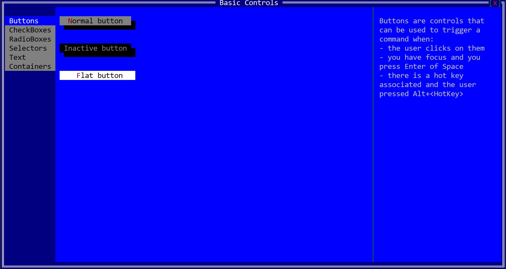

* **Code:** [examples/basic_controls](https://github.com/gdt050579/AppCUI-rs/tree/main/examples/basic_controls)
* **Elements:** [Accordion](https://gdt050579.github.io/AppCUI-rs/chapter-3/stock-controls/accordion.html), [Button](https://gdt050579.github.io/AppCUI-rs/chapter-3/stock-controls/button.html), [CheckBox](https://gdt050579.github.io/AppCUI-rs/chapter-3/stock-controls/checkbox.html), [ComboBox](https://gdt050579.github.io/AppCUI-rs/chapter-3/stock-controls/combobox.html), [CharPicker](https://gdt050579.github.io/AppCUI-rs/chapter-3/stock-controls/charpicker.html), [ColorPicker](https://gdt050579.github.io/AppCUI-rs/chapter-3/stock-controls/colorpicker.html), [DatePicker](https://gdt050579.github.io/AppCUI-rs/chapter-3/stock-controls/datepicker.html), [DropDownList](https://gdt050579.github.io/AppCUI-rs/chapter-3/stock-controls/dropdownlist.html), [HSplitter](https://gdt050579.github.io/AppCUI-rs/chapter-3/stock-controls/hsplitter.html), [Panel](https://gdt050579.github.io/AppCUI-rs/chapter-3/stock-controls/panel.html), [Password](https://gdt050579.github.io/AppCUI-rs/chapter-3/stock-controls/password.html), [RadioBox](https://gdt050579.github.io/AppCUI-rs/chapter-3/stock-controls/radiobox.html), [Selector](https://gdt050579.github.io/AppCUI-rs/chapter-3/stock-controls/selector.html), [Tab](https://gdt050579.github.io/AppCUI-rs/chapter-3/stock-controls/tab.html), [TextArea](https://gdt050579.github.io/AppCUI-rs/chapter-3/stock-controls/textarea.html), [TextField](https://gdt050579.github.io/AppCUI-rs/chapter-3/stock-controls/textfield.html), [TreeStateBox](https://gdt050579.github.io/AppCUI-rs/chapter-3/stock-controls/treestatebox.html), [VSplitter](https://gdt050579.github.io/AppCUI-rs/chapter-3/stock-controls/vsplitter.html),

  
More Examples

| Image                                           | Description                                                                                                                                                                                                                                                                                                                                                                                                                                                                                    |
| ----------------------------------------------- | --------------------------------------------------------------------------------------------------------------------------------------------------------------------------------------------------------------------------------------------------------------------------------------------------------------------------------------------------------------------------------------------------------------------------------------------------------------------------------------------- |
| 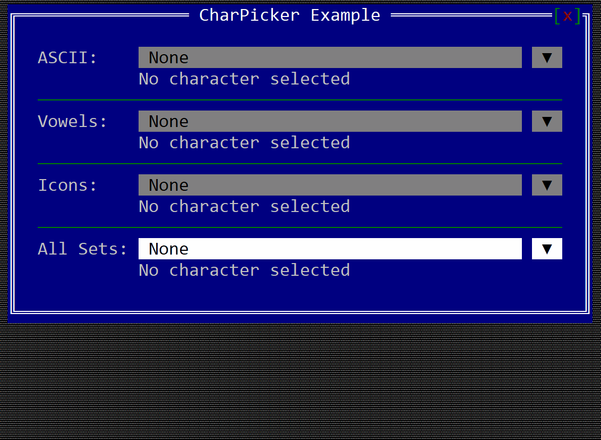 | **Char Picker**   * **Code:** [examples/charpicker](https://github.com/gdt050579/AppCUI-rs/tree/main/examples/charpicker)   * **Description:** A **CharPicker** is a UI control in AppCUI-rs that allows users to select a single character from a wide range of Unicode sets, such as ASCII, box-drawing and line-drawing symbols, arrows, geometric shapes, emoji, and other predefined or custom character groups, presented in an expandable panel for easy browsing and selection. |

---

## Lists, Trees and Graphs

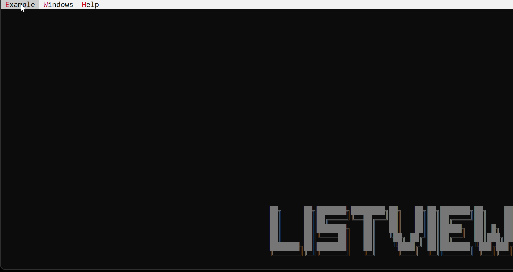

* **Code:** [examples/listview](https://github.com/gdt050579/AppCUI-rs/tree/main/examples/listview)
* **Elements:** [List View](https://gdt050579.github.io/AppCUI-rs/chapter-3/stock-controls/listview.html), [List item](https://gdt050579.github.io/AppCUI-rs/chapter-3/object-traits/listitem.html), [Menus](https://gdt050579.github.io/AppCUI-rs/chapter-4/menu.html)

  
More Examples

| Image                                | Description                                                                                                                                                                                                                                                        |
| ------------------------------------ | ----------------------------------------------------------------------------------------------------------------------------------------------------------------------------------------------------------------------------------------------------------------- |
| 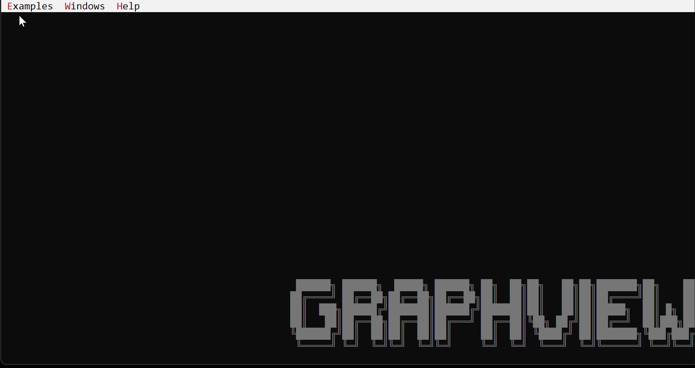 | **Graph Viewer**   * **Code:** [examples/graphs](https://github.com/gdt050579/AppCUI-rs/tree/main/examples/graphs)   * **Description:** Various animations with graphs and trees: move nodes, display orthogonal lines, search and filter data, and more. |
| 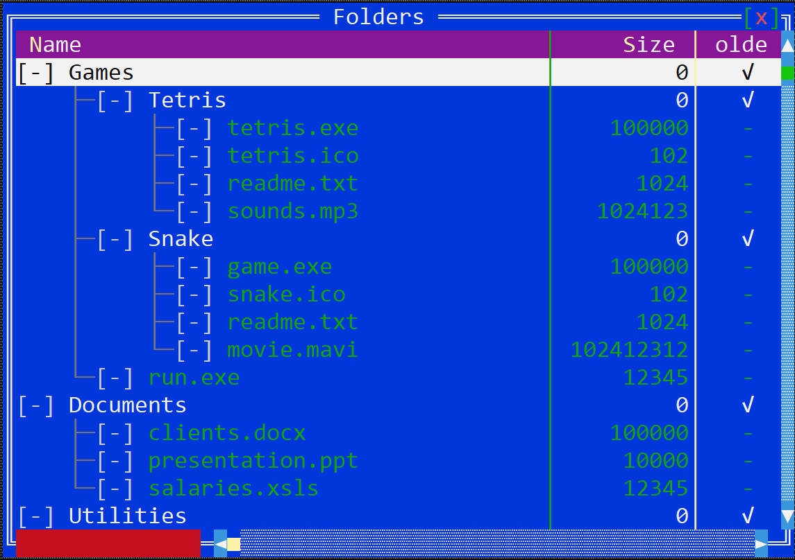  | **Tree Viewer**   * **Code:** [examples/treeview](https://github.com/gdt050579/AppCUI-rs/tree/main/examples/treeview)   * **Description:** A simple tree view with three columns where you can navigate, select, sort, filter, and fold or unfold items.            |
| 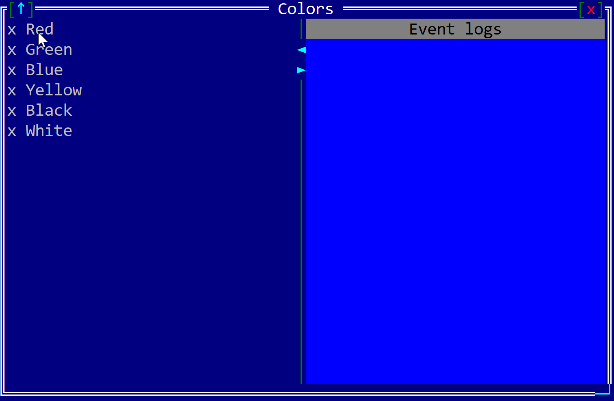   | **ListBox**   * **Code:** [examples/listbox](https://github.com/gdt050579/AppCUI-rs/tree/main/examples/listbox)   * **Description:** A list box is a simple list of multiple items (no columns; all strings) that you can select from.      |

---

## Games

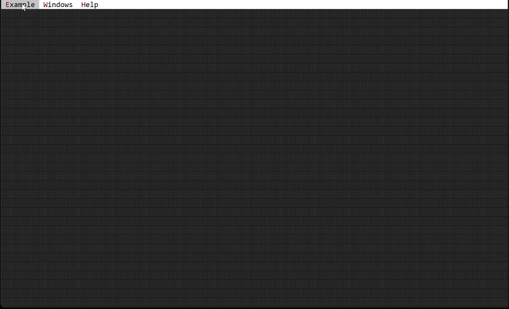

* **Code:** [examples/games](https://github.com/gdt050579/AppCUI-rs/tree/main/examples/games)
* **Elements:** [Windows](https://gdt050579.github.io/AppCUI-rs/chapter-3/event-loop/window.html), [Desktop](https://gdt050579.github.io/AppCUI-rs/chapter-4/desktop.html), [Custom Controls](https://gdt050579.github.io/AppCUI-rs/chapter-3/custom_controls.html)

  
More Examples

| Image                                  | Description                                                                                                                                                                                                                                                                                                                                                                                                                                                                                         |
| -------------------------------------- | -------------------------------------------------------------------------------------------------------------------------------------------------------------------------------------------------------------------------------------------------------------------------------------------------------------------------------------------------------------------------------------------------------------------------------------------------------------------------------------------------- |
| 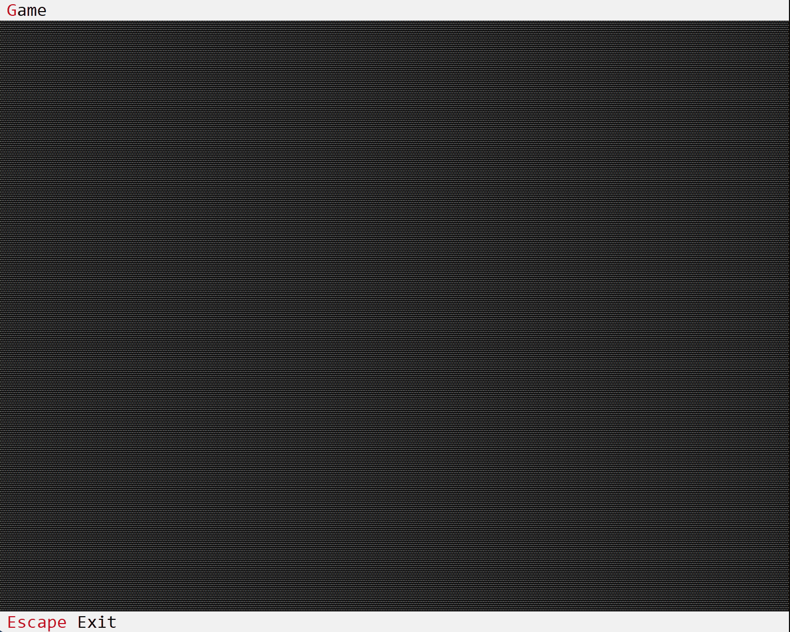 | **Minesweeper**   * **Code:** [examples/minesweeper](https://github.com/gdt050579/AppCUI-rs/tree/main/examples/minesweeper)   * **Description:** A Minesweeper-style game: find hidden mines on a grid using the mine counts shown around each cell.                                                                                                                                                                                                              |
| 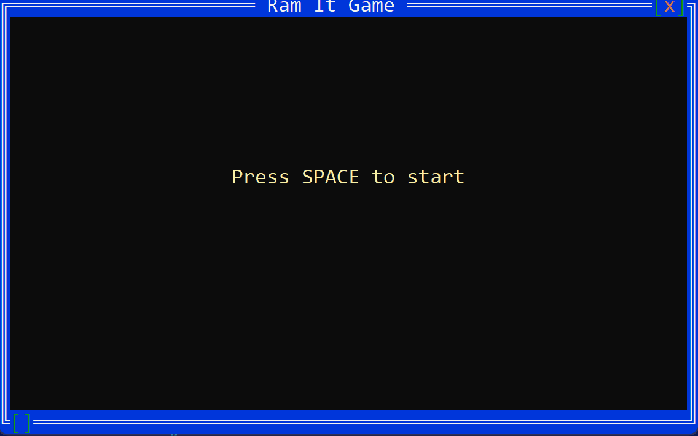       | **Ram-It**   * **Code:** [examples/ramit](https://github.com/gdt050579/AppCUI-rs/tree/main/examples/ramit)   * **Description:** A simulation of the Atari Ram-It game where colored bars scroll toward the center of the screen from both sides, and the player controls a ram block that slides up and down in the middle. The goal is to push back and eliminate the advancing bars before they reach the opposite side. The action gets faster and more difficult as the game progresses. |
| 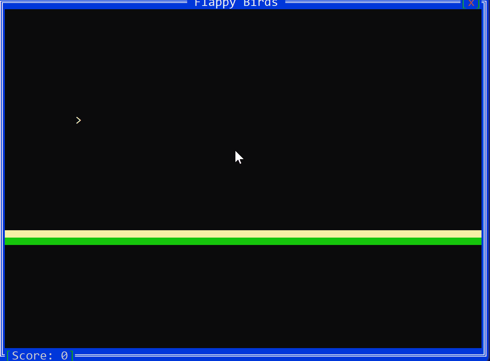      | **Flappy Bird**   * **Code:** [examples/flappy](https://github.com/gdt050579/AppCUI-rs/tree/main/examples/flappy)   * **Description:** A simple arcade game where you tap to keep a small bird in the air, guiding it through gaps between pipes without crashing; the pace is quick, and the challenge comes from precise timing.                                                                                                                                                           |

---

## Application Bar, Command Bar and Menus

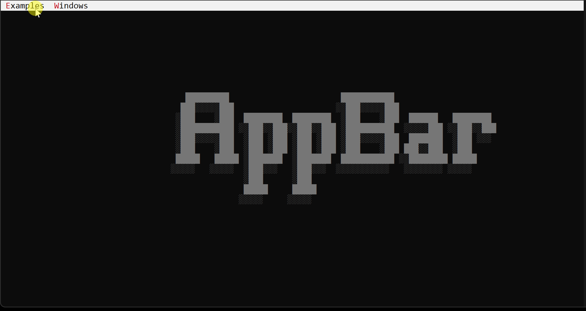

* **Code:** [examples/appbar](https://github.com/gdt050579/AppCUI-rs/tree/main/examples/appbar)
* **Elements:** [AppBar](https://gdt050579.github.io/AppCUI-rs/chapter-4/app_bar.html), [Menu Button](https://gdt050579.github.io/AppCUI-rs/chapter-4/app_bar/menu_button.html), [Separator](https://gdt050579.github.io/AppCUI-rs/chapter-4/app_bar/separator.html), [Label](https://gdt050579.github.io/AppCUI-rs/chapter-4/app_bar/label.html), [Button](https://gdt050579.github.io/AppCUI-rs/chapter-4/app_bar/button.html), [ToggleButton](https://gdt050579.github.io/AppCUI-rs/chapter-4/app_bar/toggle_button.html), [SwitchButton](https://gdt050579.github.io/AppCUI-rs/chapter-4/app_bar/switch_button.html)

  
More Examples

| Image                                 | Description                                                                                                                                                                                                                                                                                                             |
| ------------------------------------- | ---------------------------------------------------------------------------------------------------------------------------------------------------------------------------------------------------------------------------------------------------------------------------------------------------------------------- |
| 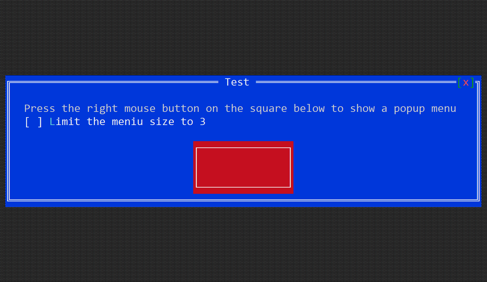 | **Popup Menu**   * **Code:** [examples/popup_menu](https://github.com/gdt050579/AppCUI-rs/tree/main/examples/popup_menu)   * **Description:** A popup menu appears when the user right-clicks a control. You can control the menu size and interact with the items directly. |

---

## Background Tasks and Timers

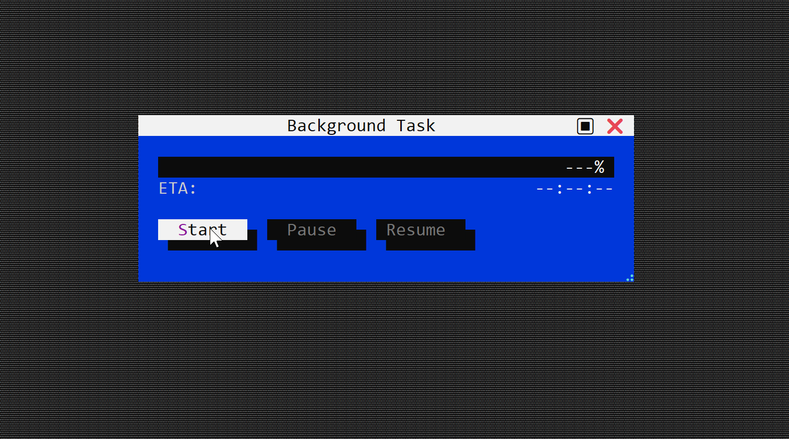

* **Code:** [examples/background_task](https://github.com/gdt050579/AppCUI-rs/tree/main/examples/background_task)
* **Elements:** [Background Tasks](https://gdt050579.github.io/AppCUI-rs/chapter-7/background_tasks.html), [Timers](https://gdt050579.github.io/AppCUI-rs/chapter-7/timers.html)

  
More Examples

| Image                            | Description                                                                                                                                                                                                                                                                                                                                                                                                                                                                 |
| -------------------------------- | -------------------------------------------------------------------------------------------------------------------------------------------------------------------------------------------------------------------------------------------------------------------------------------------------------------------------------------------------------------------------------------------------------------------------------------------------------------------------- |
| 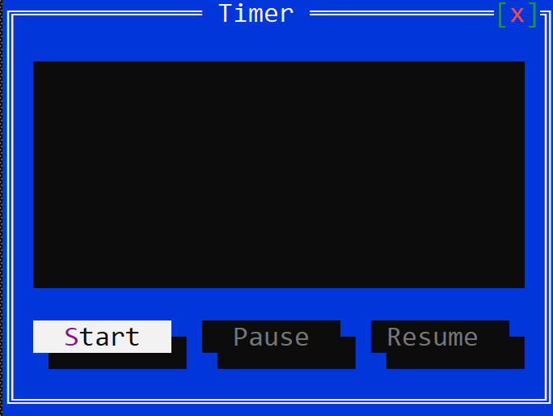 | **Timer**   * **Code:** [examples/timer](https://github.com/gdt050579/AppCUI-rs/tree/main/examples/timer)   * **Description:** The Timer example displays elapsed time using ASCII-art digits on a Canvas, updated via periodic TimerEvents. It provides Start, Pause, and Resume buttons to control execution, dynamically changing digit rendering based on paused state, and demonstrates integrating timers, custom rendering, and event handling within AppCUI. |

---
