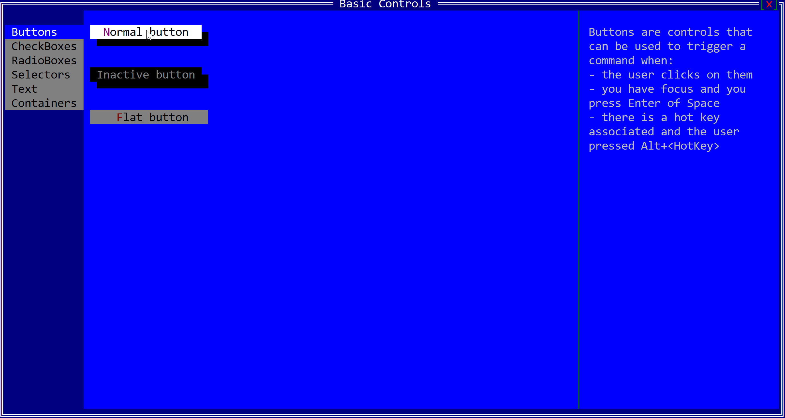

# AppCUI-rs Gallery

A visual tour of AppCUI-rs. Each category shows one quick preview; expand for more.

```
Currently this is a work in progress - expect first version to be ready by 1st of October.
```

- [AppCUI-rs Gallery](#appcui-rs-gallery)
  - [Animations](#animations)
  - [Basic Controls](#basic-controls)
  - [Lists, Trees and Graphs](#lists-trees-and-graphs)
  - [Application Bar, Command Bar and Menus](#application-bar-command-bar-and-menus)


---

## Animations


* **Code:** [examples/matrix](https://github.com/gdt050579/AppCUI-rs/tree/main/examples/matrix)
* **Elements:** [Custom Desktop](https://gdt050579.github.io/AppCUI-rs/chapter-4/custom_desktop.html), [Menus](https://gdt050579.github.io/AppCUI-rs/chapter-4/menu.html), [Timers](https://gdt050579.github.io/AppCUI-rs/chapter-7/timers.html)

<details>
  <summary>More Anmations</summary>

| Image                                   | Descrption                                                                                                                                                                                                                                                                                                                                                                                                                                                                                                         |
| --------------------------------------- | ------------------------------------------------------------------------------------------------------------------------------------------------------------------------------------------------------------------------------------------------------------------------------------------------------------------------------------------------------------------------------------------------------------------------------------------------------------------------------------------------------------------ |
|   | **Spiral Animation** <br> * **Code:** [examples/spiral](https://github.com/gdt050579/AppCUI-rs/tree/main/examples/spiral) <br> * **Description:** The Spiral example defines a struct that incrementally computes spiral coordinates in polar form, applies aspect-ratio correction, and updates them each frame to illustrate animated geometry generation.                                                                                                                                                       |
|  | **Fractal Animation** <br> * **Code:** [examples/fractal](https://github.com/gdt050579/AppCUI-rs/tree/main/examples/fractal) <br> * **Description:** The Fractal example constructs a recursive tree-like structure by generating line segments from a start point, computing endpoints using trigonometric functions, and branching at ±45° angles. Each update advances rotation, modulates scale, and regenerates points up to a configurable depth, producing an evolving visualization of recursive geometry. |
|    | **Timer** <br> * **Code:** [examples/timer](https://github.com/gdt050579/AppCUI-rs/tree/main/examples/timer) <br> * **Description:** The Timer example displays elapsed time using ASCII-art digits on a Canvas, updated via periodic TimerEvents. It provides Start, Pause, and Resume buttons to control execution, dynamically changing digit rendering based on paused state, and demonstrates integrating timers, custom rendering, and event handling within AppCUI.                                         |

</details>

---

## Basic Controls



* **Code:** [examples/basic_controls](https://github.com/gdt050579/AppCUI-rs/tree/main/examples/basic_controls)
* **Elements:** [Accordion](https://gdt050579.github.io/AppCUI-rs/chapter-3/stock-controls/accordion.html),[Button](https://gdt050579.github.io/AppCUI-rs/chapter-3/stock-controls/button.html), [CheckBox](https://gdt050579.github.io/AppCUI-rs/chapter-3/stock-controls/checkbox.html), [ComboBox](https://gdt050579.github.io/AppCUI-rs/chapter-3/stock-controls/combobox.html), [CharPicker](https://gdt050579.github.io/AppCUI-rs/chapter-3/stock-controls/charpicker.html), [ColorPicker](https://gdt050579.github.io/AppCUI-rs/chapter-3/stock-controls/colorpicker.html),[DatePicker](https://gdt050579.github.io/AppCUI-rs/chapter-3/stock-controls/datepicker.html),[DropDownList](https://gdt050579.github.io/AppCUI-rs/chapter-3/stock-controls/dropdownlist.html),[HSplitter](https://gdt050579.github.io/AppCUI-rs/chapter-3/stock-controls/hsplitter.html),[Panel](https://gdt050579.github.io/AppCUI-rs/chapter-3/stock-controls/panel.html),[Password](https://gdt050579.github.io/AppCUI-rs/chapter-3/stock-controls/password.html),[RadioBox](https://gdt050579.github.io/AppCUI-rs/chapter-3/stock-controls/radiobox.html),[Selector](https://gdt050579.github.io/AppCUI-rs/chapter-3/stock-controls/selector.html),[Tab](https://gdt050579.github.io/AppCUI-rs/chapter-3/stock-controls/tab.html),[TextArea](https://gdt050579.github.io/AppCUI-rs/chapter-3/stock-controls/textarea.html),[TextField](https://gdt050579.github.io/AppCUI-rs/chapter-3/stock-controls/textfield.html),[TreeStateBox](https://gdt050579.github.io/AppCUI-rs/chapter-3/stock-controls/treestatebox.html),[VSplitter](https://gdt050579.github.io/AppCUI-rs/chapter-3/stock-controls/vsplitter.html),

<details>
  <summary>More Anmations</summary>

| Image                                           | Descrption                                                                                                                                                                                                                                                                                                                                                                                                                                                                                    |
| ----------------------------------------------- | --------------------------------------------------------------------------------------------------------------------------------------------------------------------------------------------------------------------------------------------------------------------------------------------------------------------------------------------------------------------------------------------------------------------------------------------------------------------------------------------- |
|  | **Char Picker** <br> * **Code:** [examples/charpicker](https://github.com/gdt050579/AppCUI-rs/tree/main/examples/charpicker) <br> * **Description:** A **CharPicker** is a UI control in AppCUI-rs that allows users to select a single character from a wide range of Unicode sets, such as ASCII, box-drawing and line-drawing symbols, arrows, geometric shapes, emoji, and other predefined or custom character groups, presented in an expandable panel for easy browsing and selection. |
|                                                 |

</details>

---

## Lists, Trees and Graphs


* **Code:** [examples/listview](https://github.com/gdt050579/AppCUI-rs/tree/main/examples/listview)
* **Elements:** [List View](https://gdt050579.github.io/AppCUI-rs/chapter-3/stock-controls/listview.html), [List item](https://gdt050579.github.io/AppCUI-rs/chapter-3/object-traits/listitem.html), [Menus](https://gdt050579.github.io/AppCUI-rs/chapter-4/menu.html)

<details>
  <summary>More Anmations</summary>

| Image                                | Descrption                                                                                                                                                                                                                                                        |
| ------------------------------------ | ----------------------------------------------------------------------------------------------------------------------------------------------------------------------------------------------------------------------------------------------------------------- |
|  | **Graph Viewer** <br> * **Code:** [examples/graphs](https://github.com/gdt050579/AppCUI-rs/tree/main/examples/graphs) <br> * **Description:** Various animation with graphs/trees where you can move nodes, display orthogonal lines, search and filter data, etc |
|   | **Tree Viewer** <br> * **Code:** [examples/treeview](https://github.com/gdt050579/AppCUI-rs/tree/main/examples/treeview) <br> * **Description:** A simple tree view wth 3 columns where you can navigate, select, sort, filter, fold and unfold items.            |
|    | **ListBoxr** <br> * **Code:** [examples/listbox](https://github.com/gdt050579/AppCUI-rs/tree/main/examples/listbox) <br> * **Description:** A listbox is a simple list that has multiple items (without any columns - all strings) that you can select from.      |


</details>

---

## Application Bar, Command Bar and Menus


* **Code:** [examples/appbar](https://github.com/gdt050579/AppCUI-rs/tree/main/examples/appbar)
* **Elements:** [AppBar](https://gdt050579.github.io/AppCUI-rs/chapter-4/app_bar.html), [Menu Button](https://gdt050579.github.io/AppCUI-rs/chapter-4/app_bar/menu_button.html), [Separator](https://gdt050579.github.io/AppCUI-rs/chapter-4/app_bar/separator.html), [Label](https://gdt050579.github.io/AppCUI-rs/chapter-4/app_bar/label.html), [Button](https://gdt050579.github.io/AppCUI-rs/chapter-4/app_bar/button.html), [ToggleButton](https://gdt050579.github.io/AppCUI-rs/chapter-4/app_bar/toggle_button.html), [SwitchButton](https://gdt050579.github.io/AppCUI-rs/chapter-4/app_bar/switch_button.html)
